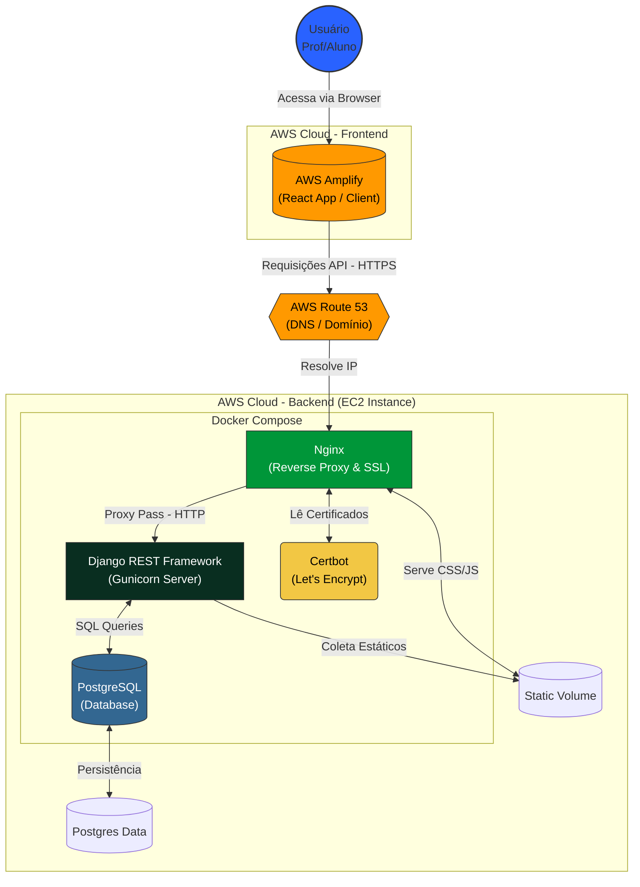

<div align="center">
  
  <p><strong>Sistema de Gestão para Academias e Personal Trainers</strong><p>
</div>

---
## 🎯 Objetivo do Sistema

O sistema visa facilitar a rotina de professores e personal trainers, permitindo uma visualização rápida e detalhada do perfil de cada aluno, automatizando cálculos fisiológicos e fornecendo ferramentas digitais para prescrição de treinos e monitoramento de saúde.

## 🚀 Principais Funcionalidades

### 👨‍🏫 Para o Professor
- **Gestão Centralizada:** Visualização rápida do perfil e dados completos de cada aluno.
- **Automação de Avaliações:** Cálculo automático do IMC e registro de circunferências corporais.
- **Monitoramento de Saúde:** Registro e acompanhamento de Pressão Arterial (PA) e Controle Glicêmico (CC), com relatórios detalhados (pré, durante e pós-treino).
- **Fichas de Treino Digitais:** Ferramenta intuitiva para criação e atribuição de fichas de treino personalizadas.

### 🏋️‍♂️ Para o Aluno
- **Interface Amigável:** Design intuitivo, acessível e com alta legibilidade.
- **Acesso Rápido:** Visualização clara e direta da ficha de treino do dia.

## 🛠️ Tecnologias Utilizadas

### Backend
- **Linguagem:** Python
- **Framework:** Django & Django REST Framework (DRF)
- **Banco de Dados:** PostgreSQL
- **Infraestrutura:** Docker & Docker Compose
- **Servidor Web:** Nginx & Gunicorn
- **Documentação:** Swagger / OpenAPI (drf-spectacular)

### Frontend
- **Linguagem:** TypeScript
- **Framework:** React
- **Build Tool:** Vite
- **Estilização:** Styled Components
- **PWA:** Vite Plugin PWA

Arquitetura do Sistema

Abaixo, o diagrama de componentes e fluxo de dados da infraestrutura do PERFIT na AWS:

## 🏃‍♂️ Como Executar o Projeto

### Pré-requisitos
- [Docker](https://www.docker.com/) e Docker Compose instalados.
- [Node.js](https://nodejs.org/) (versão 18 ou superior) e npm instalados.

### 1. Backend (API & Banco de Dados)

O backend é totalmente containerizado. Para iniciar:

```bash
# Na raiz do projeto
docker-compose up --build
```

Isso iniciará:
- Banco de dados PostgreSQL
- API Django (porta 8000)
- Nginx (porta 80)

### 2. Frontend (Aplicação Web)

Em um novo terminal, execute o cliente React:

```bash
# Navegue até a pasta do cliente
cd PERFIT/client

# Instale as dependências
npm install

# Inicie o servidor de desenvolvimento
npm run dev
```

## 🧭 Como Navegar e Testar

- **Aplicação Web:** Acesse o link exibido no terminal do frontend (geralmente `http://localhost:5173`).
- **Documentação da API (Swagger):** Com o backend rodando, acesse `http://localhost:8000/api/docs/` para visualizar e testar os endpoints da API.
- **Painel Administrativo:** Acesse `http://localhost:8000/admin/` para gerenciar usuários e dados diretamente (requer criação de superusuário).

## 👥 Integrantes do Grupo

| Nome | Função |
|------|--------|
| **FABIO QUEIROZ VIEIRA** |Data Modeler, Database Designer, Data Architect, Systems Analyst|
| **GUSTAVO KESLEY DE FONTES NUNES** | Scrum Master |
| **JOÃO GUSTAVO SOUZA LIMA** | Product owner, Back-end Developer, Cloud Developer |
| **JOHAN PEDRO DE QUEIROZ** | Front-end Developer|
